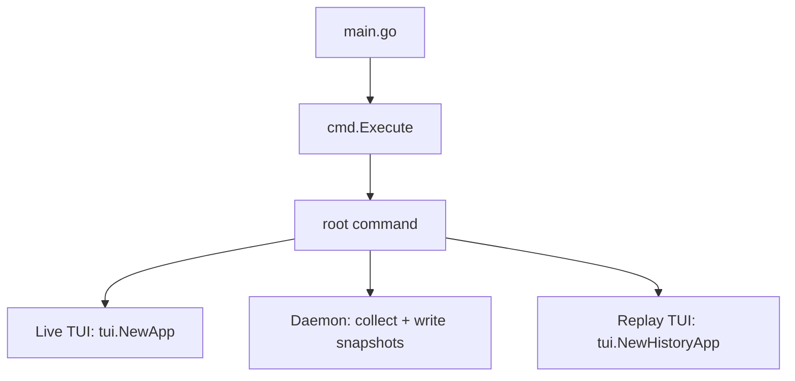

# High Level Design

## 1) Runtime Modes

This project now has 3 runtime paths:

1. `holyf-network` (live TUI, existing mode)
2. `holyf-network daemon start/stop/status/prune` (snapshot collector daemon lifecycle + manual retention prune)
3. `holyf-network replay` (read-only history TUI)



## 2) Live TUI (Existing Path)

`refreshData()` in `internal/tui/app_core.go` remains the central loop:

1. Collect conntrack snapshot and rates.
2. Collect TCP retrans snapshot and rates.
3. Collect connection state counts.
4. Collect interface stats and rates.
5. Collect top talkers (`/proc/net/tcp*`, PID mapping from `/proc/<pid>/fd`).
6. Collect conntrack TCP flows (hybrid parse: extended + plain output), then merge host-facing NAT tuples when `/proc` misses sockets (Docker/NAT case).
7. Compute conntrack byte deltas and per-row throughput metrics (`TX/s`, `RX/s`).
8. Fallback collect socket counters from `ss` and overlay missing bandwidth.
9. Enrich top talkers with throughput metrics and internal total-delta fields for ranking/sort.
10. Build live Top Connections diagnosis from:
   - connection states
   - retrans health/sample gate
   - conntrack pressure/drops
   - top talker culprit extraction for dominant TCP-state patterns
11. Render panels and status bar.

`ct/nat` in live Top Connections means the row is conntrack/NAT-derived visibility (not direct host PID ownership).

Live Top Connections also has a few important presentation behaviors:

- `View=GROUP` groups by `(peer, process)` and keeps the row compact (`PORTS`, queues, bandwidth, process).
- The selected row gets an inline footer preview (`Selected Detail`) with the full grouped state breakdown and the effective `Enter`/`k` target.
- The diagnosis note is host-global in v1; it is not scoped to the current filter/search slice.

Live TUI is the only mode that can run active mitigation (`k`, block/kill flow).

### 2.1) Active mitigation path (block vs kill flow)

Mitigation is implemented in `internal/tui/app_blocking_runtime.go` and `internal/actions/peer_blocker.go`.

Execution paths:

1. Timed block (`minutes > 0`, from `k/Enter` flow):
   - Step 1: insert firewall DROP rules (`BlockPeer`) with `iptables`/`ip6tables` for `INPUT` + `OUTPUT`.
   - Step 2: clear active connections with bounded converge sweep:
     - `KillPeerFlows` loop (default: max `4s`, max `12` iterations, sleep `120ms`)
     - each iteration:
       - broad `ss -K` pass
       - exact tuple kill pass (`KillSockets`) from real-time full socket query + current snapshot tuples
       - `conntrack -D` pass
       - re-count active sockets
     - active kill scope: all matching states except `TIME_WAIT`
     - `TIME_WAIT` is tracked for diagnostics only (not kill-failure criterion)
   - Step 3: start timer and auto-unblock at expiry (`UnblockPeer` removes DROP rules).

2. Kill-only (`minutes = 0`):
   - Do not insert firewall rules.
   - Run the same bounded connection-clearing sweep.
   - Accept that new matching connections can appear during the sweep window under storm/race.

Important clarification:

- `iptables/ip6tables` is for block/unblock policy only.
- Actual active flow termination uses `ss -K` and `conntrack -D`.
- Under conn storm/race windows, converge can return partial (`remaining N (storm/race)`) by design when bounded limits are hit.
- `minutes = 0` is pure kill-only semantics.

### 2.2) Metric sources, formulas, and equivalent shell commands

All per-second metrics in app use the same pattern:

`rate = (current_counter - previous_counter) / elapsed_seconds`

If `previous` is missing (first sample) or `elapsed_seconds <= 0`, the app shows baseline/first-reading semantics.

1. Conntrack table pressure + counters (`internal/collector/conntrack.go`)
   - Source:
     - `/proc/sys/net/netfilter/nf_conntrack_count`
     - `/proc/sys/net/netfilter/nf_conntrack_max`
     - `conntrack -S` (fields `insert`, `drop`)
   - Formulas:
     - `usage_percent = current / max * 100`
     - `inserts_per_sec = (curr_insert - prev_insert) / elapsed`
     - `drops_per_sec = (curr_drop - prev_drop) / elapsed`
   - UI emphasis:
     - live panel focuses on `Used / Max`, `Conntrack%`, and non-zero `Drops`
     - `inserts_per_sec` is still collected but is not shown in the main panel anymore
   - Commands:
     - `cat /proc/sys/net/netfilter/nf_conntrack_count`
     - `cat /proc/sys/net/netfilter/nf_conntrack_max`
     - `conntrack -S`

2. TCP retransmission (`internal/collector/tcp_retransmits.go`)
   - Source: `/proc/net/snmp` (`Tcp:` row, fields `OutSegs`, `RetransSegs`)
   - Formulas:
     - `retrans_per_sec = (curr_retrans - prev_retrans) / elapsed`
     - `out_segs_per_sec = (curr_out - prev_out) / elapsed`
     - `retrans_percent = delta_retrans / delta_out * 100` (only when `delta_out > 0`)
   - Health gate (LOW SAMPLE in UI):
     - evaluate retrans health only when:
       - `ESTABLISHED >= retrans_sample.min_established`
       - `OutSegsPerSec >= retrans_sample.min_out_segs_per_sec`
   - Commands:
     - `awk '/^Tcp:/{if(!h){h=$0;next} v=$0; print h; print v; exit}' /proc/net/snmp`

3. Connection states (`internal/collector/connections.go`)
   - Source:
     - `/proc/net/tcp`
     - `/proc/net/tcp6`
   - Logic:
     - count `st` (hex state) across both files using fixed map (`01=ESTABLISHED`, `06=TIME_WAIT`, `0A=LISTEN`, ...)
   - Commands:
     - raw hex states: `cat /proc/net/tcp /proc/net/tcp6 | awk 'NR>1{print $4}' | sort | uniq -c`
     - readable cross-check: `ss -tanH | awk '{print $1}' | sort | uniq -c | sort -nr`

4. Interface throughput/packets (`internal/collector/interface_stats.go`)
   - Source: `/sys/class/net/<iface>/statistics/*`
     - `rx_bytes`, `tx_bytes`, `rx_packets`, `tx_packets`, `rx_errors`, `tx_errors`, `rx_dropped`, `tx_dropped`
   - Formulas:
     - `rx_bytes_per_sec = delta(rx_bytes) / elapsed`
     - `tx_bytes_per_sec = delta(tx_bytes) / elapsed`
     - `rx_pkts_per_sec = delta(rx_packets) / elapsed`
     - `tx_pkts_per_sec = delta(tx_packets) / elapsed`
     - errors/drops shown as cumulative counters (not per-sec)
   - Commands:
     - `cat /sys/class/net/<iface>/statistics/rx_bytes`
     - `cat /sys/class/net/<iface>/statistics/tx_bytes`
     - `ip -s link show dev <iface>`

5. Top Connections queue columns (`internal/collector/top_connections.go`)
   - Source:
     - `/proc/net/tcp`, `/proc/net/tcp6` field `tx_queue:rx_queue`
   - Formulas:
     - `Send-Q = tx_queue`
     - `Recv-Q = rx_queue`
     - internal activity score `Activity = tx_queue + rx_queue`
   - Extra enrichment:
     - PID/Proc mapping via `/proc/<pid>/fd/* -> socket:[inode]` and `/proc/<pid>/comm`
     - conntrack host-facing merge for NAT/Docker visibility (`internal/collector/conntrack_merge.go`)
       - synthetic process label: `ct/nat`
       - only injects `ESTABLISHED` tuples missing from `/proc` socket view
   - Commands:
     - `ss -tnap` (human-readable queue + process cross-check)

6. Per-connection bandwidth (`internal/collector/conntrack_flows.go`, `bandwidth_tracker.go`, `socket_counters.go`, `socket_bandwidth_tracker.go`)
   - Primary source:
     - union of:
       - `conntrack -L -p tcp -o extended -n`
       - `conntrack -L -p tcp`
     - flows are de-duplicated by canonical tuple key
     - duplicate preference favors richer `bytes=` counters (then larger byte totals)
     - parse both directional `bytes=` counters per flow (orig/reply)
   - Primary formulas:
     - `tx_delta = clamp(curr_orig_bytes - prev_orig_bytes)`
     - `rx_delta = clamp(curr_reply_bytes - prev_reply_bytes)`
     - `tx_per_sec = tx_delta / elapsed`
     - `rx_per_sec = rx_delta / elapsed`
     - `clamp(x) = max(x, 0)` (handles counter reset/wrap)
   - Behavior:
     - first sample is baseline (no rates)
     - first-seen flow after baseline counts current bytes as delta (to capture short-lived flows)
   - Fallback source (only overlay rows still 0):
     - `ss -tinHn` metrics `bytes_acked` / `bytes_received`
   - Commands:
     - `conntrack -L -p tcp -o extended -n`
     - `conntrack -L -p tcp`
     - `cat /proc/sys/net/netfilter/nf_conntrack_acct` (should be `1` for byte accounting)
     - `ss -tinHn`

## 3) Daemon Snapshot Pipeline

Package: `internal/history` + `cmd/daemon.go`

1. `daemon start` launches internal worker in background and writes PID/log/runtime state paths.
2. Worker resolves interface (`--interface`) and starts `SnapshotWriter` with lock file (`.daemon.lock`) under `--data-dir`.
3. Every `--interval` seconds:
   - call `collector.CollectTopTalkers(0)` to sample current connections
   - call `collector.CollectConntrackFlowsTCP()` and merge host-facing conntrack NAT tuples into live sample
   - synthetic NAT tuples are persisted as `proc_name=ct/nat` when host PID ownership is unavailable
   - compute byte deltas from previous sample
   - enrich connections with bandwidth fields
   - aggregate by `peer_ip + local_port + proc_name` with sums:
     - `conn_count = count(rows)`
     - `tx_queue = sum(TxQueue)`, `rx_queue = sum(RxQueue)`, `total_queue = sum(Activity)`
     - `tx_bytes_delta = sum(TxBytesDelta)`, `rx_bytes_delta = sum(RxBytesDelta)`, `total_bytes_delta = sum(TotalBytesDelta)`
     - `tx_bytes_per_sec = sum(TxBytesPerSec)`, `rx_bytes_per_sec = sum(RxBytesPerSec)`
   - sort + cap (`--top-limit`) by:
     - `total_bytes_delta DESC`
     - `conn_count DESC`
     - `total_queue DESC`
     - then deterministic tie-break: `peer_ip`, `local_port`, `proc_name`
   - write one aggregate `SnapshotRecord` as JSON Lines record (one JSON object per line)
4. Segment file naming by server local day: `connections-YYYYMMDD.jsonl`.
5. Retention:
   - remove segments older than `--retention-hours`
   - daemon runtime prune schedule:
     - once at startup
     - daily at local `00:00`
   - manual prune command:
     - `holyf-network daemon prune`
6. Active daemon state file (`daemon.state`) is the default source of truth for `status/stop/prune` without explicit targeting flags.
   - includes runtime metadata such as `retention_hours` for prune default resolution
7. `daemon prune` without explicit target flags uses active-state target resolution.
8. `daemon stop` sends `SIGTERM` (fallback `SIGKILL`) and removes PID file + active state.
9. `daemon status` reports running/stopped from active-state or explicit flags.
10. Default Linux root paths:
   - snapshots: `/var/lib/holyf-network/snapshots`
   - daemon log: `/var/log/holyf-network/daemon.log`
   - active-state: `/run/holyf-network/daemon.state`
11. Worker handles `SIGINT/SIGTERM` and closes cleanly.
12. Interval guidance:
   - bandwidth-focused monitoring: `5-10s`
   - connection trend monitoring: `30s` default
   - large intervals can miss short-lived flows in snapshots/replay

File format note:

- Snapshot segments follow JSON Lines format: https://jsonlines.org/
- `.jsonl` file contract:
  - UTF-8 text
  - one complete JSON object per line
  - line order is chronological append order
  - each line is one `SnapshotRecord`
- Full on-disk format reference: `docs/SNAPSHOT_FORMAT.md`

## 4) Snapshot Storage Model

Single format policy:

- aggregate snapshot format only
- no compatibility reader for older raw-connection snapshot schemas

### Record model (`internal/history/types.go`)

- `SnapshotRecord`
  - `CapturedAt`
  - `Interface`
  - `TopLimit` (max aggregate rows)
  - `SampleSeconds`
  - `BandwidthAvailable`
  - `Groups []SnapshotGroup`
  - `Version`

- `SnapshotGroup`
  - queue snapshot fields: `TxQueue`, `RxQueue`, `TotalQueue`
  - bandwidth fields: `TxBytesDelta`, `RxBytesDelta`, `TotalBytesDelta`, `TxBytesPerSec`, `RxBytesPerSec`, `TotalBytesPerSec`

- `SnapshotRef`
  - `FilePath`
  - `Offset`
  - `CapturedAt`
  - `ConnCount`

### On-disk example (`.jsonl` one line)

```json
{"captured_at":"2026-03-08T12:56:30.196962352+07:00","interface":"eth0","top_limit":500,"sample_seconds":29.999999695,"bandwidth_available":true,"groups":[{"peer_ip":"172.25.110.116","local_port":22,"proc_name":"sshd","conn_count":2,"tx_queue":0,"rx_queue":0,"total_queue":0,"tx_bytes_delta":377892,"rx_bytes_delta":41164,"total_bytes_delta":419056,"tx_bytes_per_sec":12596.400128063402,"rx_bytes_per_sec":1372.1333472833558,"total_bytes_per_sec":13968.533475346758,"states":{"ESTABLISHED":2}}],"version":"v0.3.16"}
```

### Reader model (`internal/history/reader.go`)

- `LoadIndex(dataDir)`:
  - scan segment files oldest->latest
  - parse each line to produce refs
  - skip malformed JSON lines and count `Corrupt`
- `ReadSnapshot(ref)`:
  - seek by byte offset
  - decode one line into `SnapshotRecord`

## 5) Replay TUI (Read-only)

Package: `internal/tui/history_*.go` + `cmd/replay.go`

State includes:

- snapshot refs + current index
- current snapshot record
- optional single-file scope (`replay --file <segment>`)
- optional inclusive time window scope (`replay -b/--begin`, `-e/--end`)
- filter/search/sort/mask/selection
- follow-latest toggle (`L`)

Navigation keys:

- `[` previous snapshot
- `]` next snapshot
- `a` oldest
- `e` latest
- `t` jump to specific timestamp

Behavior constraints:

- replay index is filtered by `file scope ∩ time window` before UI state/navigation
- when no `--file/-f` and no `--begin/-b`/`--end/-e`, replay defaults to current local day window
- `-b/-e` parse with replay jump-time semantics; clock-only inputs use:
  - selected segment date when `--file` is provided
  - current local date when `--file` is not provided
- when only one bound is provided:
  - `-b` only => end bound auto-completes to end-of-day
  - `-e` only => begin bound auto-completes to start-of-day
- replay renders aggregate rows only
- kill/block hotkeys (`Enter`, `k`, `b`) are explicitly blocked with status note
- `/` search/filter applies only to current snapshot
- `Shift+S` timeline search scans all loaded snapshots in current replay scope
- replay renders queue + bandwidth columns from aggregate rows
- replay rows keep `proc_name` exactly as persisted (including `ct/nat` synthetic NAT label)
- replay data source resolution:
  - explicit hidden `--data-dir` override
  - else active daemon state `data_dir`
  - else runtime default snapshot dir

## 6) UI Composition

### Live mode (`layout.go`)

- Left: `Top Connections`
- Right stack: `Connection States`, `Interface Stats`, `Conntrack`
- Bottom: status bar
- Live `GROUP` view groups by `(peer, process)` for clarity under mixed ownership (`sshd` + `ct/nat`, etc.)
- Top Connections can render up to two live note lines above the table:
  - diagnosis note
  - bandwidth note
- Top Connections can also render a footer preview for the selected row when panel height allows.

### Replay mode (`history_layout.go`)

- Single panel: `Connection History`
- Bottom: replay status bar
- Overlay help/filter/search pages only

## 7) Persistence

1. Action history (live mode)
   - `~/.holyf-network/history.log`
   - rolling 500 events
   - `h` shows latest 20

2. Connection snapshots (daemon/replay)
   - root default: `/var/lib/holyf-network/snapshots`
   - non-root/dev default: `~/.holyf-network/snapshots`
   - daily JSON Lines segment files (`connections-YYYYMMDD.jsonl`)
   - retention via age (`--retention-hours`)

## 8) Concurrency Model

- TUI updates always go through `tview.Application.QueueUpdateDraw`.
- Live mode and replay mode each own their own app state struct.
- `SnapshotWriter` serializes appends with mutex and lock file for single-writer safety.

## 9) External Dependencies and OS Assumptions

- Linux runtime (`/proc`, `/sys`, netfilter tooling).
- Collector path relies on kernel network procfs/sysfs files.
- Bandwidth/NAT enrichment relies on conntrack TCP dumps (`-o extended` + plain fallback) and tuple normalization.
- `ct/nat` indicates conntrack-derived NAT visibility, not direct host process PID ownership.
- Mitigation path uses:
  - `iptables`/`ip6tables` for block/unblock rules
  - `ss -K` + `conntrack -D` for killing active flows
- `sudo` recommended for full live-mode visibility/mitigation.

## 10) Extension Guidelines

1. Put read-only scraping into `internal/collector`.
2. Put side effects into `internal/actions` or `internal/history` (for snapshot persistence).
3. Keep renderer files (`panel_*.go`) side-effect free.
4. Keep interaction flow split by mode (`app_*` for live, `history_*` for replay).
5. Add tests for parsing/indexing/retention and key handling regressions.
