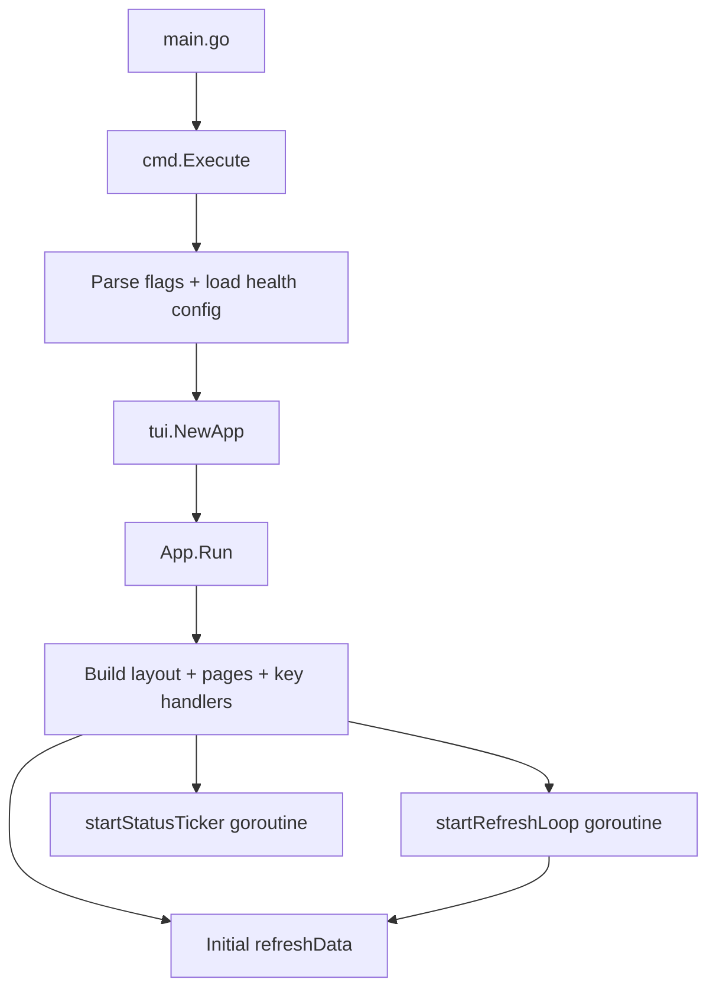

# High Level Design

## 1) Runtime Pipeline

## 2) Data Collection and Rendering

`refreshData()` in `internal/tui/app_core.go` is the central update function:

1. Collect conntrack snapshot and rates.
2. Collect TCP retrans snapshot and rates.
3. Collect connection state counts.
4. Collect interface stats and rates.
5. Collect top talkers (`/proc/net/tcp*`, with PID/proc mapping from `/proc/<pid>/fd`).
6. Render each panel (`panel_*.go`) as plain colored text.
7. Update status bar and transient notes.

Design choice:
- Collectors are read-only and mostly stateless.
- `App` owns previous snapshots (`prev*`) to compute per-second rates.

## 3) UI Composition and State

Layout (`internal/tui/layout.go`):

- Left wide column: `Top Connections` (primary operational panel).
- Right stacked column:
  - `Connection States`
  - `Interface Stats`
  - `Conntrack`
- Bottom: status bar.

Main state lives in `tui.App`:

- Focus, zoom, pause, refresh timing.
- Filters (`portFilter`, `textFilter`), sort mode, group mode.
- Selection index for Top Connections.
- Blocking state (`activeBlocks`) + action logs.

Concurrency model:

- UI updates happen via `tview.Application.QueueUpdateDraw`.
- Background goroutines only schedule updates; they do not mutate widgets directly.
- Mutexes protect mutable shared maps/slices (`activeBlocks`, action log state).

## 4) Block/Kill Peer Flow

`k` or `Enter` from Top Connections opens block flow:

1. Kill form (`kill-peer-form`): peer IP, local port (if not already filtered), block minutes.
2. Confirm modal (`kill-peer`):
   - `minutes == 0`: kill-only mode.
   - `minutes > 0`: add firewall block + terminate active flows.
3. Background execution (`app_blocking_runtime.go`):
   - block via `actions.BlockPeer` (iptables INPUT+OUTPUT rule with comment)
   - kill flows via `actions.QueryAndKillPeerSockets` + fallback tuple kill
   - drop conntrack entries via `actions.DropPeerConnections`
   - summary popup + action log
4. Auto-unblock timer for timed blocks.

Blocked peers modal (`b`) supports:

- listing active blocks,
- selection,
- remove/unblock selected entry,
- Enter/Delete shortcuts,
- result popup.

## 5) Health Strip Logic

Rendered in `panel_connections.go`.

Inputs:

- retrans percentage from `/proc/net/snmp`
- conntrack drops/sec and usage

Current retrans evaluation has sample gates:

- minimum `ESTABLISHED` connections,
- minimum `OutSegsPerSec`.

If gate not met:

- show `LOW SAMPLE`,
- do not escalate WARN/CRIT from retrans.

Thresholds are loaded from `config/health_thresholds.toml` via `internal/config/health_thresholds.go`.

## 6) Persistence

Action history:

- path: `~/.holyf-network/history.log`
- append per action
- rotate to latest 500 events
- `h` modal shows latest 20

No other long-lived app state is currently persisted.

## 7) External Dependencies and OS Assumptions

Hard requirements:

- Linux runtime (`/proc`, `/sys`, netfilter tools).
- Commands used by mitigation/advanced stats: `iptables`/`ip6tables`, `conntrack`, `ss`.
- `sudo` recommended for full visibility and mitigation.

Graceful behavior:

- Some panels degrade when specific tools are missing (for example conntrack rate stats).

## 8) Extension Guidelines

If adding new feature:

1. Put read-only OS scraping into `internal/collector`.
2. Put side effects into `internal/actions`.
3. Keep `panel_*.go` rendering-only (no shell calls, no state mutation).
4. Keep modal/interaction flow in focused `app_*.go` files.
5. Add regression tests in `internal/tui/*_test.go`.

This keeps architecture stable and prevents `app_core.go` from growing uncontrollably again.
