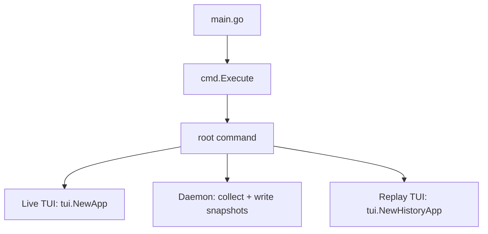

# High Level Design

## 1) Runtime Modes

This project now has 3 runtime paths:

1. `holyf-network` (live TUI, existing mode)
2. `holyf-network daemon start/stop/status` (snapshot collector daemon lifecycle)
3. `holyf-network replay` (read-only history TUI)

## 2) Live TUI (Existing Path)

`refreshData()` in `internal/tui/app_core.go` remains the central loop:

1. Collect conntrack snapshot and rates.
2. Collect TCP retrans snapshot and rates.
3. Collect connection state counts.
4. Collect interface stats and rates.
5. Collect top talkers (`/proc/net/tcp*`, PID mapping from `/proc/<pid>/fd`).
6. Render panels and status bar.

Live TUI is the only mode that can run active mitigation (`k`, block/kill flow).

## 3) Daemon Snapshot Pipeline

Package: `internal/history` + `cmd/daemon.go`

1. `daemon start` launches internal worker in background and writes PID/log paths.
2. Worker resolves interface (`--interface`) and starts `SnapshotWriter` with lock file (`.daemon.lock`) under `--data-dir`.
3. Every `--interval` seconds:
   - call `collector.CollectTopTalkers(--top-limit)`
   - write one `SnapshotRecord` as NDJSON line
4. Segment file naming by UTC hour: `connections-YYYYMMDD-HH.jsonl`.
5. Retention:
   - remove segments older than `--retention-hours`
   - enforce `--max-files` by deleting oldest remaining
6. `daemon stop` sends `SIGTERM` (fallback `SIGKILL`) and removes PID file.
7. `daemon status` reads PID file and reports running/stopped state.
8. Worker handles `SIGINT/SIGTERM` and closes cleanly.

## 4) Snapshot Storage Model

### Record model (`internal/history/types.go`)

- `SnapshotRecord`
  - `CapturedAt`
  - `Interface`
  - `TopLimit`
  - `Connections []collector.Connection`
  - `Version`

- `SnapshotRef`
  - `FilePath`
  - `Offset`
  - `CapturedAt`
  - `ConnCount`

### Reader model (`internal/history/reader.go`)

- `LoadIndex(dataDir)`:
  - scan segment files oldest->latest
  - parse each line to produce refs
  - skip malformed JSON lines and count `Corrupt`
- `ReadSnapshot(ref)`:
  - seek by byte offset
  - decode one line into `SnapshotRecord`

## 5) Replay TUI (Read-only)

Package: `internal/tui/history_*.go` + `cmd/replay.go`

State includes:

- snapshot refs + current index
- current snapshot record
- filter/search/sort/group/mask/selection
- follow-latest toggle (`L`)

Navigation keys:

- `[` previous snapshot
- `]` next snapshot
- `Home` oldest
- `End` latest

Behavior constraints:

- replay uses top connection renderers in read-only mode
- kill/block hotkeys (`Enter`, `k`, `b`) are explicitly blocked with status note
- search/filter apply only to current snapshot

## 6) UI Composition

### Live mode (`layout.go`)

- Left: `Top Connections`
- Right stack: `Connection States`, `Interface Stats`, `Conntrack`
- Bottom: status bar

### Replay mode (`history_layout.go`)

- Single panel: `Connection History`
- Bottom: replay status bar
- Overlay help/filter/search pages only

## 7) Persistence

1. Action history (live mode)
   - `~/.holyf-network/history.log`
   - rolling 500 events
   - `h` shows latest 20

2. Connection snapshots (daemon/replay)
   - `~/.holyf-network/snapshots` by default
   - hourly NDJSON segment files
   - retention via age + max files

## 8) Concurrency Model

- TUI updates always go through `tview.Application.QueueUpdateDraw`.
- Live mode and replay mode each own their own app state struct.
- `SnapshotWriter` serializes appends with mutex and lock file for single-writer safety.

## 9) External Dependencies and OS Assumptions

- Linux runtime (`/proc`, `/sys`, netfilter tooling).
- Collector path relies on kernel network procfs/sysfs files.
- Mitigation path relies on `iptables`/`ip6tables`, `conntrack`, `ss`.
- `sudo` recommended for full live-mode visibility/mitigation.

## 10) Extension Guidelines

1. Put read-only scraping into `internal/collector`.
2. Put side effects into `internal/actions` or `internal/history` (for snapshot persistence).
3. Keep renderer files (`panel_*.go`) side-effect free.
4. Keep interaction flow split by mode (`app_*` for live, `history_*` for replay).
5. Add tests for parsing/indexing/retention and key handling regressions.
