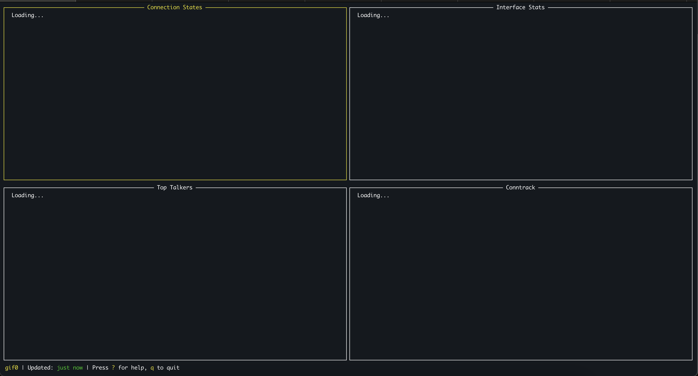
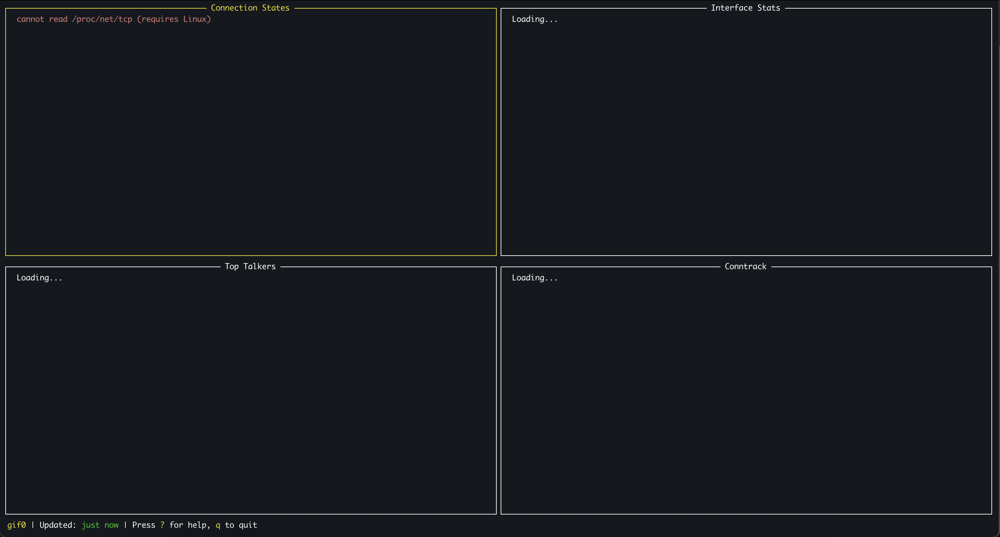
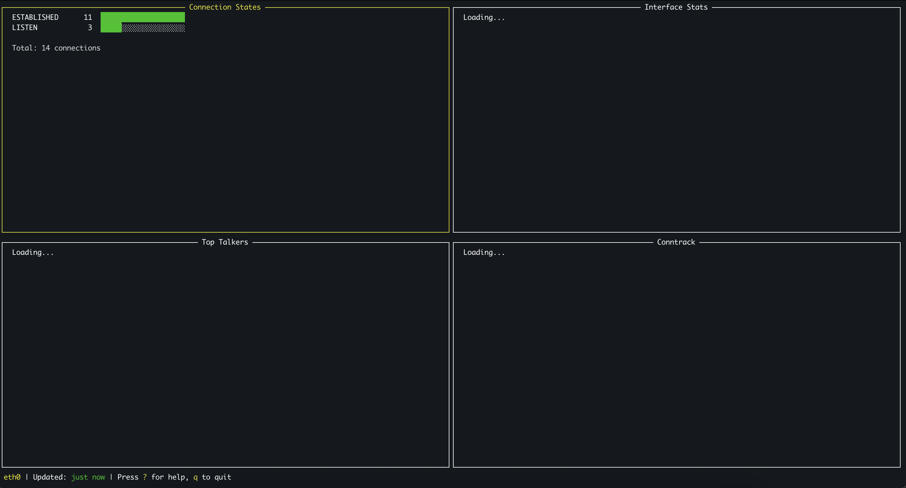
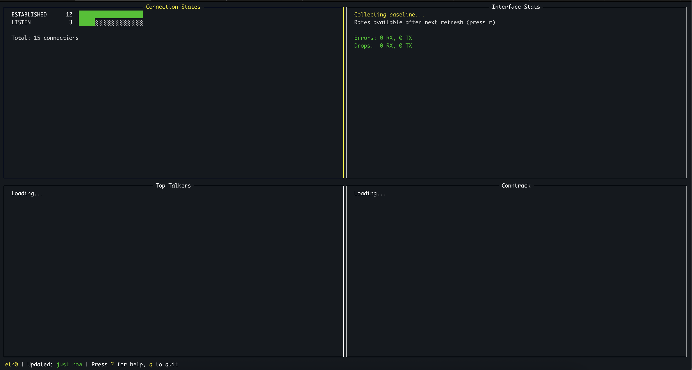
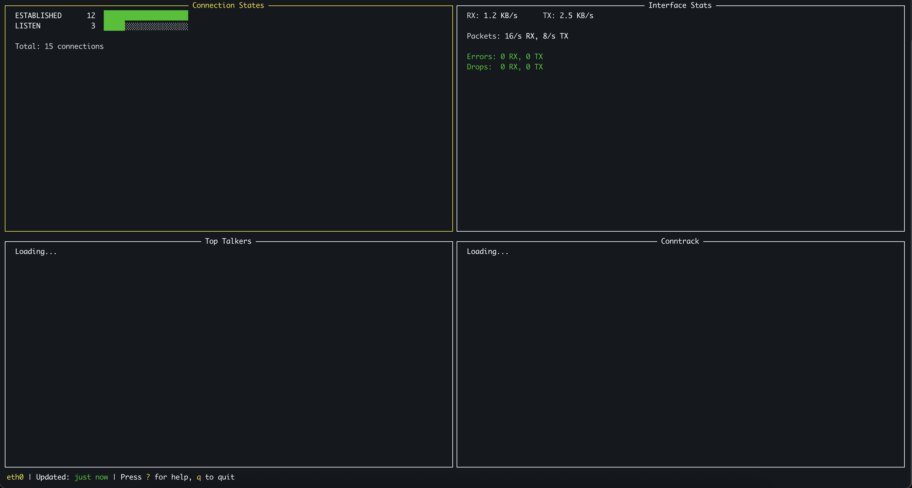
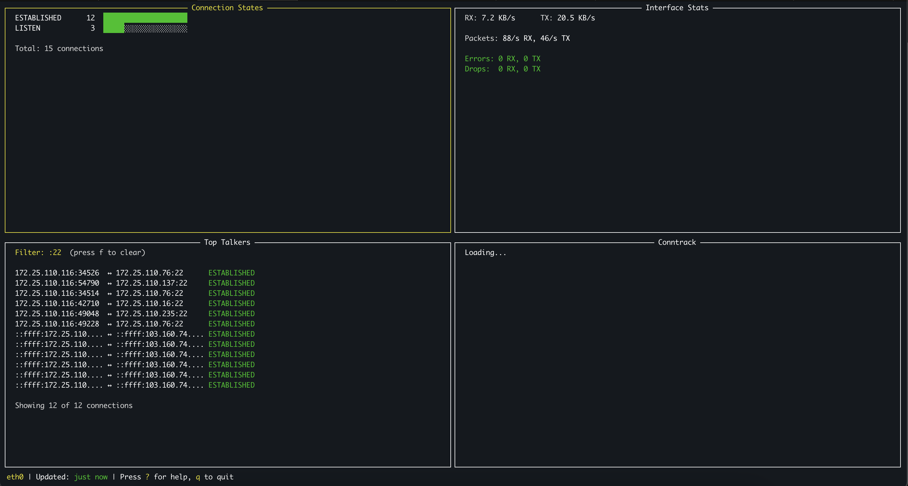
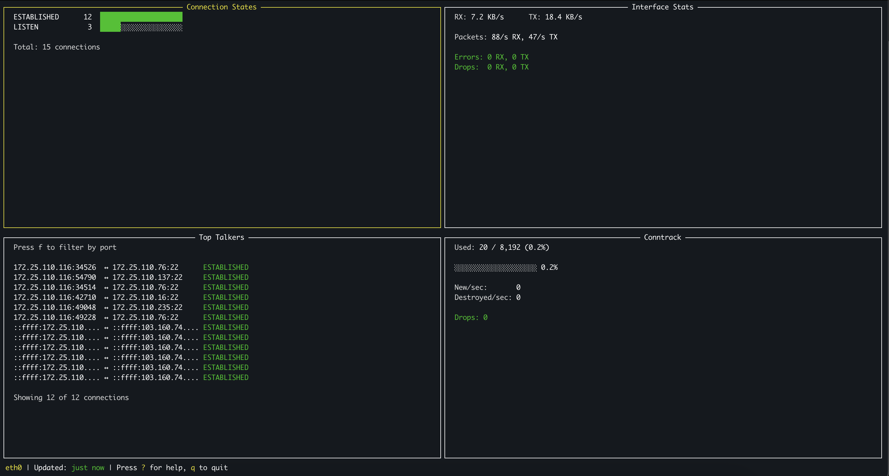
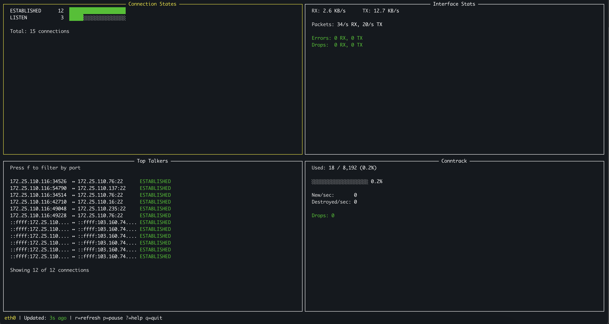

# Day 1 - Mar 02, 2026

# Sprint 1: Project Setup & TUI Framework (CLI + TUI )
Build TUI and demo first, no real interaction at all. All is mock data, like "Loading..."

## Epic 1 (CLI Skeleton)

Init Module: `go mod init github.com/BlackMetalz/holyf-network`

No idea If i really need that in future, LOL.

So Gemini generated 3 files
- `cmd/root.go`: this is where cobra root cli, where it handle/add flag for commands. 
- `internal/network/interface.go`: this is where it list all network interface, and detect default interface.
- `main.go`: this is where it execute the root command.


### ListInterfaces() function
It parses `/sys/class/net/` in Linux, we only support Linux right now!

### DetectDefaultInterface() function
It parses /proc/net/route

### Output of Epic 1
```bash
kienlt@Luongs-MacBook-Pro holyf-network % go run . -v
holyf-network version 0.1.0
kienlt@Luongs-MacBook-Pro holyf-network % go run . -h
HolyF-network - A terminal UI dashboard for monitoring network health on Linux servers.

Usage:
  holyf-network [flags]

Flags:
  -h, --help               help for holyf-network
  -i, --interface string   Network interface to monitor (default: auto-detect)
      --list-interfaces    List available network interfaces and exit
  -r, --refresh int        Refresh interval in seconds (1-300) (default 30)
  -v, --version            version for holyf-network
kienlt@Luongs-MacBook-Pro holyf-network % go run . --list-interfaces
Available network interfaces:
  - gif0
  - stf0
  ......
```

## Epic 2 (TUI Framework)

So Gemini generated 4 files
- `internal/tui/app.go`: this is where it create tui app, and handle key event. Build grid 2x2 + status bar.
- `internal/tui/layout.go`: this is where it create layout for tui app. Struct `App` + key handler.
- `internal/tui/panels.go`: this is where it create panels for tui app.
- `internal/tui/help.go`: this is where it create help modal for tui app.

### Run + Key
Run it: `./holyf-network -i interace-name-here`

`Tab` for change panel!
`?` for help!
`q` for quit!

### Output of Epic 2

Demo:



# Sprint 2: Panel 1 + 2

## Epic 3 Connection states

Gemini generated 2 new files:

`internal/collector/connections.go`: Parser for `/proc/net/tcp` and `/proc/net/tcp6`
- `tcpStateMap` - map hex code (`01`, `0A`...) into state name (`ESTABLISHED`, `LISTEN`....)
- `parseProcNetTCP()` - read file and get field index 3 (hex state), count
- `SortedStates()` - return states in order of displays (`ESTABLISHED` first then `TIME_WAIT`)

`internal/tui/panel_connections.go`: render panel:
- `renderBar()`: bar graph (████░░░░░), with max count
- Color coding: `TIME_WAIT` > 1000 --> Yellow, `CLOSE_WAIT` > 100 --> red
- `formatNumber()`: Add `m` (`1,234,567`)

And yeah, in macOS would display `cannot read /proc/net/tcp (requires Linux)`

## Output:

In local:


Live: I need to commit first before continue update!


recheck with netstat, look good to me:
```bash
# THIS IS FOR NETSTAT
root@kienlt-jump:~# netstat -alpn|grep -w LISTEN | wc -l
3
root@kienlt-jump:~# netstat -alpn|grep ESTA | wc -l
12
# This is for SS
root@kienlt-jump:~# ss -tuna -o state established -H| wc -l
12
root@kienlt-jump:~# ss -tuna -o state listening -H| wc -l
3
```

## Epic 4 (Interface Stats)

### interface_stats.go — Collects network interface statistics from /sys/class/net/<iface>/statistics/

- Each counter is separated file (`rx_bytes`, `tx_bytes`, `rx_packets`)
- `CalculateRates()`: compare 2 snapshots to calculate rate/sec. `Need to read 2 times` to get rate, first time will display "Collecting baseline..."
- `prevIfaceStats` (pointer) - `nil` for the first time, after that it will save old snapshot.

Test way: run binary, click `r` 2 times.

### Output: 
Need to commit this first...






# Sprint 3: Panel 3+4

## Epic 5 - Top Talker Panel

### Parse /proc/net/tcp for individual connections, sort by queue activity, show top 20 with port filter.

### Ouput:


## Epic 6 - Conntrack Panel

### Parse /proc/net/stat/nf_conntrack for insert/delete/drop counts.

### Ouput:


# Sprint 4: 

## Epic 7: Real-time + polish
Holy fuck polish, it means remove all comment in code. Holy fucking shit!

### Auto-refresh

```bash
./holyf-network -i eth0 -r 5
```

- Data auto-refresh every 5 seconds
- Update status bar: `updated: 3s ago...`
- `p` -> `PAUSED` display red, `p` again --> resume
- `r` -> refresh immediately
- `q` -> remove goroutine on exit.

### Output:


# Sprint 5:

### Epic 8: Implement TCP retransmits feature
