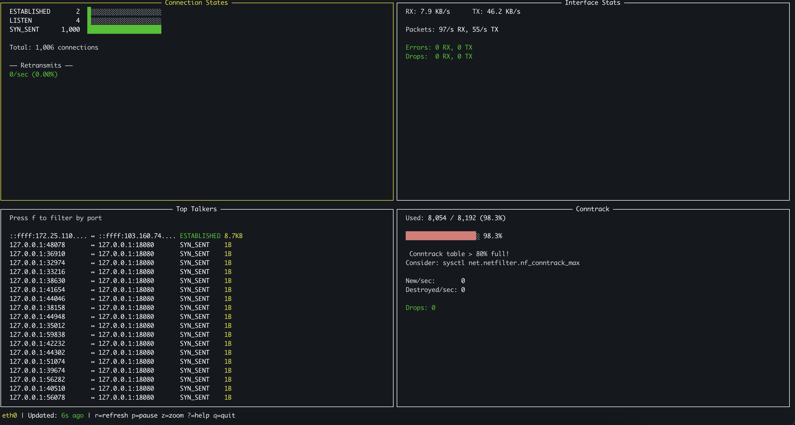

# Day 2 - Mar 03, 2026

### Little improvement connection panels

I like this, i want to include
```bash
root@kienlt-jump:~# ss -s
Total: 182
TCP:   5 (estab 2, closed 0, orphaned 0, timewait 0)

Transport Total     IP        IPv6
RAW	  1         0         1
UDP	  3         3         0
TCP	  5         2         3
INET	  9         5         4
FRAG	  0         0         0
```

```bash
# sysctl net.ipv4.tcp_fin_timeout
net.ipv4.tcp_fin_timeout = 60
# cat /proc/sys/net/netfilter/nf_conntrack_count
2
# cat /proc/sys/net/netfilter/nf_conntrack_max
8192
# cat /proc/sys/net/ipv4/ip_local_port_range
32768	60999
```

### Little output
Using demo client/server.

We can see max Conntrack
